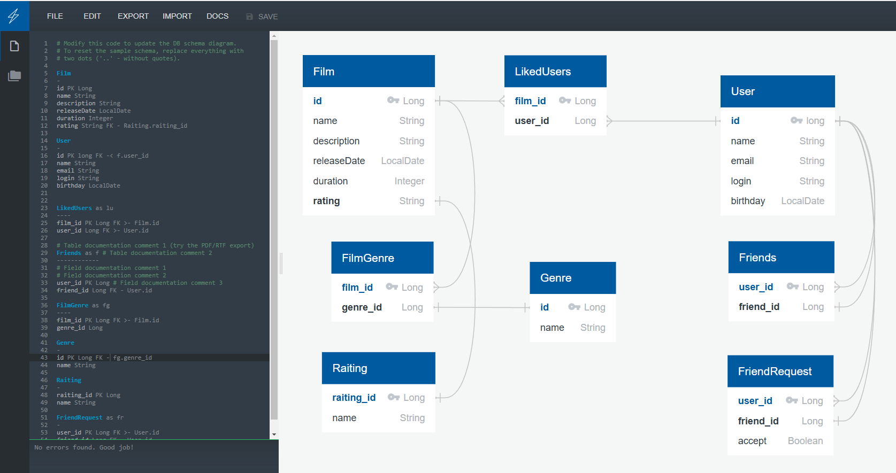

# java-filmorate
Template repository for Filmorate project.

В конце 12 спринта дата-модели, использованные в 11 спринте, планирую разбить
на таблицы с указанными связями. Для примера, при поступлении запроса о жанре
фильма будет указываться ID фильма, по этому ID в таблице FilmGenre будут
найдены все соответствующие жанры, их ID, а по их ID будут найдены названия